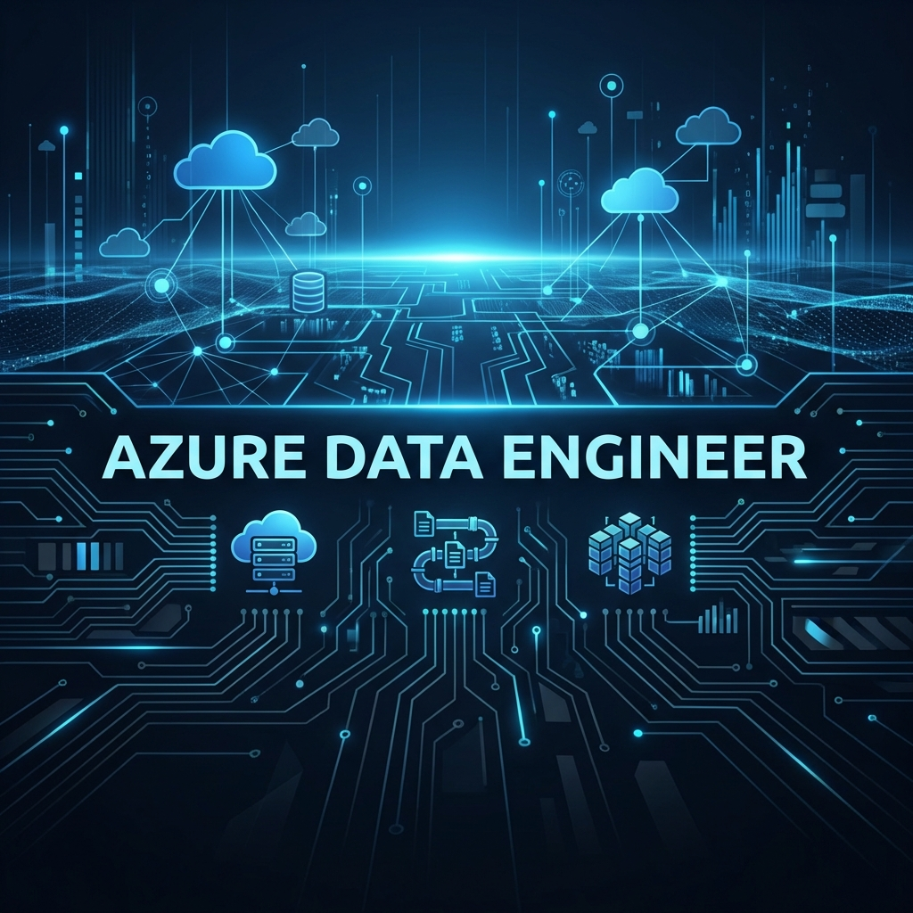

<div align="center">
  
</div>

<div align="center">
  
  # Hey, I'm Aman 👋
  
  ### ☁️ Azure Data Engineer | 🚀 Building Scalable Data Pipelines
  
  [](https://amaninsights.vercel.app/)
  [](https://linkedin.com/in/aman2805)
  [](mailto:amansarohadev@gmail.com)

</div>

---

<div align="center">
  <br />
  
  <br />
</div>

---

## 👨‍💻 About Me

<table align="center">
  <tr>
    <td width="50%" valign="top">
      <br />
      <p>I design and build production-grade data infrastructure on Azure. My focus is on creating reliable ETL/ELT pipelines, optimizing data warehouses, and enabling data-driven decision making through robust architecture.</p>
      
```python
class AzureDataEngineer:
    def __init__(self):
        self.name = "Aman Saroha"
        self.role = "Data Engineer"
        self.location = "India 🇮🇳"
        self.cloud = "Microsoft Azure"
        
    def core_competencies(self):
        return [
            "Data Pipeline Architecture",
            "Big Data Processing",
            "Data Warehousing", 
            "Cloud Security & Governance"
        ]
```
    </td>
    <td width="50%" valign="top">
      <h3 align="center">Tech Stack</h3>
      <div align="center">
        <!-- Azure Core -->
        
        
        <br />
        <!-- Big Data & Compute -->
        
        
        <br />
        <!-- Languages -->
        
        
        
        <br />
        <!-- Tools -->
        
        
      </div>
    </td>
  </tr>
</table>

---

## 📊 GitHub Stats

<div align="center">
  <table align="center">
    <tr>
      <td>
        
      </td>
      <td>
        
      </td>
    </tr>
  </table>
  
</div>

---

## 📌 Featured Projects

<table>
<tr>
<td width="50%">

### 🏪 [Vendor Performance Analysis](https://github.com/amaninsights/Vendor-Performance-Analysis)
End-to-end retail analytics pipeline analyzing 2GB+ data with automated ingestion, SQL transformations, statistical testing & Power BI dashboards.

**Key Findings:** Identified $2.7M unsold inventory capital

`Python` `SQLAlchemy` `Power BI` `Statistical Testing`

</td>
<td width="50%">

### 📊 [Data Science Job Market](https://github.com/amaninsights/data-science-job-market)
Comprehensive analysis of 800K+ job postings to uncover optimal skills, salary trends, and market insights for data professionals.

**Key Finding:** SQL appears in 51% of postings

`Pandas` `Seaborn` `Matplotlib` `EDA`

</td>
</tr>
<tr>
<td width="50%">

### 🏨 [Hotel Booking Analysis](https://github.com/amaninsights/Hotel-Booking-Analysis)
Cancellation prediction and revenue optimization analysis with hypothesis testing and actionable business recommendations.

**Key Finding:** 37% cancellation rate impact analysis

`Python` `Power BI` `Statistical Analysis`

</td>
<td width="50%">

### 💼 [HR Analytics MySQL](https://github.com/amaninsights/hr-analytics-mysql)
Production-ready HR analytics with advanced SQL - window functions, CTEs, and dashboard-ready views for employee insights.

**Techniques:** RANK, ROW_NUMBER, Partitions

`MySQL` `Window Functions` `Views` `Indexing`

</td>
</tr>
</table>

---

<div align="center">

### 🎯 Goals

| Focus Area | Objective |
| :--- | :--- |
| **Certification** | DP-203 (Data Engineering on Azure) |
| **Architecture** | Master Lakehouse patterns with Databricks |
| **Orchestration** | Advanced Airflow & ADF pipelines |

---

### 📫 Let's Connect!

I'm always open to interesting conversations and collaboration opportunities.

[](https://linkedin.com/in/aman2805)
[](mailto:amansarohadev@gmail.com)

</div>
