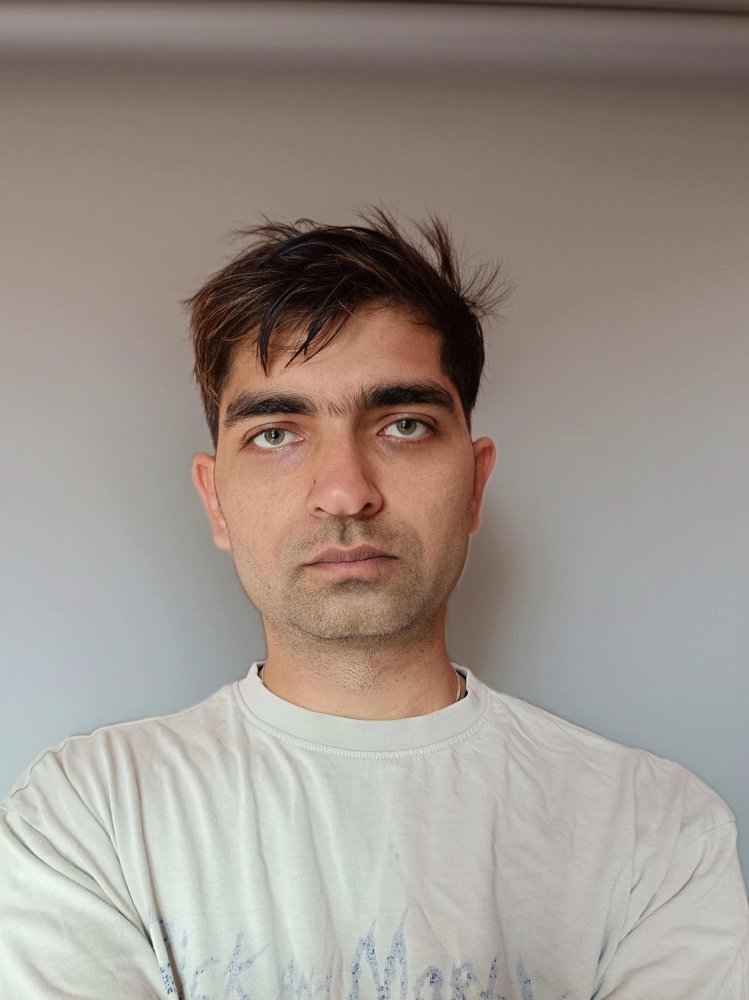

<div align="center">

<!-- Avatar -->


<!-- Name -->
<h1 style="margin: 12px 0 4px;">
  <a href="https://readme-typing-svg.demolab.com?font=Syne&weight=800&size=38&pause=1000&color=00d4ff&center=true&vCenter=true&width=600&lines=Aman">
    
  </a>
</h1>

<!-- Subtitle — the power statement -->
<a href="https://readme-typing-svg.demolab.com?font=JetBrains+Mono&weight=500&size=18&pause=1000&color=F59E0B&center=true&vCenter=true&width=700&lines=Azure+Data+Specialist+%7C+Data+Analyst;Ex-HCL+Technologies+%7C+Microsoft+Client;Medallion+Architecture+%7C+ADF+%7C+Databricks;SQL+%E2%86%92+Pipelines+%E2%86%92+Dashboards">
  
</a>

<br /><br />

<!-- Nav Links -->
[](https://amansarohadev.vercel.app)
[](https://linkedin.com/in/amansarohadev)
[](mailto:amansarohadev@gmail.com)
[](https://github.com/amansarohadev)

</div>

---

## 🎯 The Origin Story

> *"I spent 14 months keeping Microsoft's Azure SQL databases alive in production at HCL Technologies. Now I'm building the data pipelines and warehouses behind them."*

I'm a **B.Tech graduate (2022)** with a background that runs through **enterprise Microsoft support → deliberate cloud engineering pivot → live 2026 portfolio sprint**.

While most engineers learn in sandboxes, I was diagnosing **critical production SQL deadlocks, performance bottlenecks, and high-priority escalations** as an **Azure SQL DB Technical Support Engineer at HCL Technologies** — with **Microsoft as the direct client**.

In January 2024, I made a calculated decision: go deep into **Azure Data Engineering**. I call the 26-month period that followed my *"Advanced Cloud Residency"*.

Today I'm applying for **Data Analyst** and **Azure Data Specialist** roles simultaneously — and actively committing to GitHub every week.

---

## 🔴 What I'm Building Right Now

| Status | Project | Stack | Repo |
|--------|---------|-------|------|
| **● LIVE** | SQL Data Warehouse — Medallion Architecture | Azure Synapse · PySpark · Bronze/Silver/Gold | [→ View](https://github.com/amansarohadev/azure-de-learning-journal) |
| **● LIVE** | ADF Pipeline System — Incremental Loads | Azure Data Factory · Parent-Child Pipelines | [→ View](https://github.com/amansarohadev/adf) |
| **⚡ Next** | Power BI Dashboard — Advanced DAX | Power BI · DAX · Data Modeling | Coming soon |

---

## 🛤️ The Journey

```
Oct 2022 ─────── Dec 2023        Jan 2024 ────────────── Feb 2026        March 2026 → Now
      │                                   │                                      │
 HCL Technologies               Advanced Cloud                           Active Sprint
 Microsoft Client               Residency                                DA + ADE Roles
 Azure SQL DB                   ADF · Databricks                         Applying Now
 Tech Support Eng.              Synapse · PySpark                        GitHub: Active
      │                         Medallion Arch.                               │
      └───────────────────────────────────────────────────────────────────────┘
                    Every step intentional. Every commit deliberate.
```

---

## ⚡ Data Engineering Track

| Tool | Proficiency |
|------|-------------|
| Azure Data Factory | ██████████░ 85% |
| Azure Databricks | █████████░░ 80% |
| PySpark | ████████░░░ 78% |
| Azure Synapse Analytics | ███████░░░░ 75% |
| Medallion Architecture | ██████████░ 85% |
| Incremental Load + Parent-Child Patterns | █████████░░ 83% |

**Cloud & Compute**


---

## 📊 Data Analytics Track

**BI & Visualization**


**Languages & Databases**


---

## 🗂️ Featured Projects

<table>
<tr>
<td width="50%">

### ⚡ ADF Pipeline System
Enterprise-grade incremental load pipelines with Parent-Child orchestration. Schema drift handling, retry logic, parameterized ingestion.

**Stack:** `Azure Data Factory` `PySpark` `Azure`

[](https://github.com/amansarohadev/adf)


</td>
<td width="50%">

### 🏗️ SQL Data Warehouse — Medallion
End-to-end DW from scratch. Bronze (raw) → Silver (clean) → Gold (analytics-ready). Full transformation layer.

**Stack:** `Azure Synapse` `SQL DW` `Medallion Architecture`

[](https://github.com/amansarohadev/azure-de-learning-journal)


</td>
</tr>
<tr>
<td width="50%">

### 📦 Vendor Performance Analysis
End-to-end retail pipeline. 2GB+ dataset, Python + SQLAlchemy, statistical hypothesis testing, Power BI dashboard.

**Stack:** `Python` `SQLAlchemy` `Power BI` `Statistics`

[](https://github.com/amansarohadev/Vendor-Performance-Analysis)

</td>
<td width="50%">

### 🏡 Seattle Airbnb Market Insights
Full EDA revealing pricing patterns, seasonality, and neighborhood intelligence. 15+ view Tableau dashboard.

**Stack:** `Python` `Pandas` `Tableau` `EDA`

[](https://github.com/amansarohadev/airbnb-market-insights-seattle)

</td>
</tr>
</table>

---

## 📊 GitHub Stats

<div align="center">
  
  
</div>

<div align="center">
  
</div>

---

<div align="center">

### 💡 The Gap Isn't the Weakness — It's the Differentiator.

*From production SQL support at Microsoft to engineering the data pipelines behind enterprise decisions.*
*Every month of the "residency" was a deposit. March 2026 is the withdrawal.*

**[→ Portfolio](https://amansarohadev.vercel.app) · [→ LinkedIn](https://linkedin.com/in/amansarohadev) · [→ Email](mailto:amansarohadev@gmail.com)**

</div>
